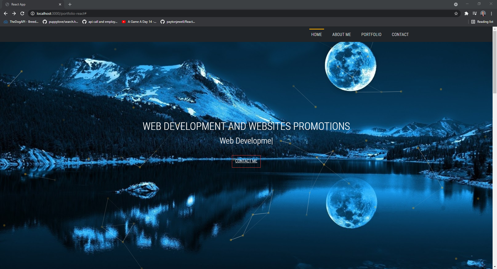
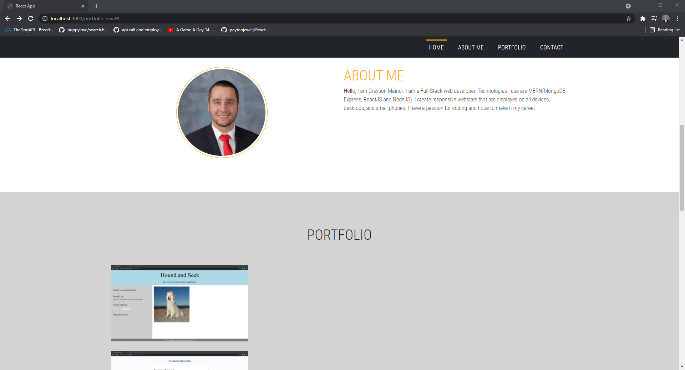
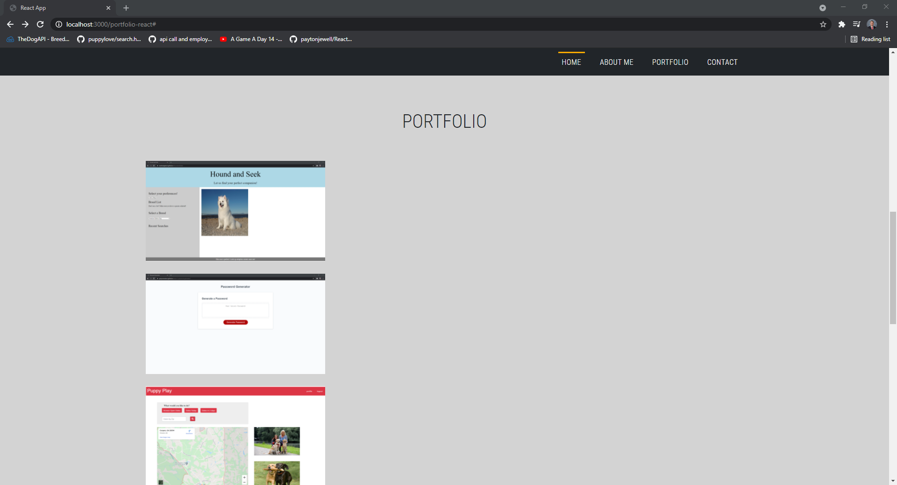
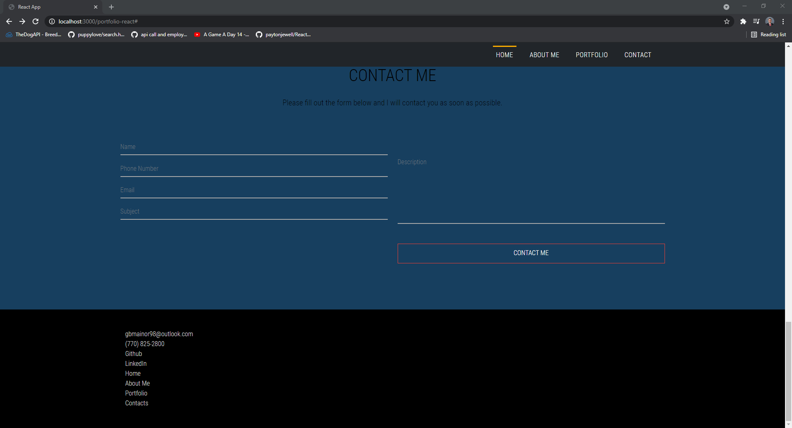

# React Portfolio






## Description
This Application is a refactor of my portfolio using react.  This application containes information about me and my works as a fullstack developer.
 ## Table of contents

-[Installation](#installation)

-[Deployed](#Deployed)

-[Usage](#usage)

-[License](#license)

-[Contributing](#contributing)

-[Tests](#tests)

-[Questions](#questions)

## Installation

In order to run this script you have to have the following things downloaded using npm i.
```
  "@fortawesome/fontawesome-svg-core"
    "@fortawesome/free-solid-svg-icons"
    "@fortawesome/react-fontawesome"
    "@testing-library/jest-dom"
    "@testing-library/react"
    "@testing-library/user-event"
    "bootstrap"
    "emailjs-com"
    "gh-pages"
    "react"
    "react-dom"
    "react-hook-form"
    "react-particles-js"
    "react-popupbox"
    "react-scripts"
    "react-scroll"
    "react-share"
    "react-typed"
    "web-vitals"
```

## Deployed
https://greysonmainor.github.io/portfolio-react/

## Usage

This application is web based and as such can only be used to view the code I have written.  It is also deployed to heroku.
## License

N/A


## Contributing
Contributing to this file is not yet available as it is a personal homework project.  Check back in the future for other projects to contribute on.

## Tests

To run tests, run the following command:

```
N/A
```

## Questions

### Github:
github.com/GreysonMainor

### Email:
gbmainor98@outlook.com
  